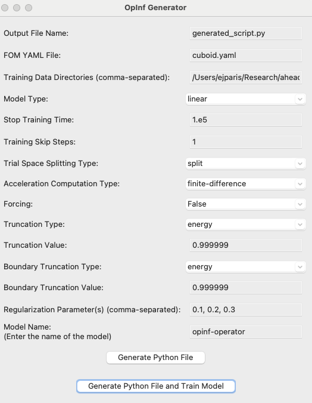

# Operator Inference repository for Norma

Repository of python code for performing operator inference in Norma

##Getting started

Clone this repo

```bash
git clone git@gitlab-ex.sandia.gov:ejparis/norma-opinf.git
```


Install (for easy development, consider an editable install)
```
pip install -e .
```

Issues with Sandia proxies?

```
pip --trusted-host pypi.org --trusted-host pypi.python.org --trusted-host files.pythonhosted.org install -e .
```

##Quick-start for running OpInf

To run OpInf, we need to first generate data.

In your main Norma file, make sure to have CSV write sidesets: True and CSV output interval set, e.g., for "cuboid.yaml"

```yaml
type: single
input mesh file: ../cuboid.g
output mesh file: cuboid.e
Exodus output interval: 1
CSV output interval: 1
CSV write sidesets: true
```

Running norma will create the relevant data files, and you can create an OpInf model one of two ways:

1.) You can write and run a training script, with a template provided here: 

```
norma-opinf/examples/example_opinf_drivers
```
2.) You can use the GUI, which is launched via:

```py
python /path-to-norma-opinf/normaopinf/opinf/app.py 
```

This will launch the following GUI. From this GUI, you can both generate a training script and/or generate a training script and execute it. Note that the training script will always be saved so it can be modifed or re-run later.




##


